# ingest-v2 — Architecture & Design

> Kotlin rewrite of the Azure Data Explorer (Kusto) ingestion SDK.
> Built on **Ktor** (HTTP), **kotlinx.coroutines** (async), **kotlinx.serialization** (JSON), and the **Azure SDK** (auth & blob storage).

---

## Table of Contents

1. [Module Overview](#1-module-overview)
2. [High-Level Architecture](#2-high-level-architecture)
3. [Package Breakdown](#3-package-breakdown)
   - [3.1 `client/`](#31-client--ingestion-clients)
   - [3.2 `client/policy/`](#32-clientpolicy--managed-streaming-decisions)
   - [3.3 `builders/`](#33-builders--client-construction)
   - [3.4 `uploader/`](#34-uploader--blob-upload-engine)
   - [3.5 `uploader/compression/`](#35-uploadercompression--compression-strategies)
   - [3.6 `source/`](#36-source--ingestion-data-sources)
   - [3.7 `common/`](#37-common--shared-infrastructure)
4. [Program Flow — Queued Ingestion](#4-program-flow--queued-ingestion)
5. [Program Flow — Streaming Ingestion](#5-program-flow--streaming-ingestion)
6. [Program Flow — Managed Streaming](#6-program-flow--managed-streaming)
7. [Configuration & Caching](#7-configuration--caching)
8. [Auth & Security](#8-auth--security)

---

## 1. Module Overview

`ingest-v2` is a ground-up Kotlin rewrite of the Kusto ingestion client. It supports three ingestion modes:

| Mode | When to use |
|------|-------------|
| **Queued** | Default. Upload blob → DM queues it for ingestion. Best for large/batch data. |
| **Streaming** | Low-latency. POST data directly to the engine. Limited to ~4 MB per request. |
| **Managed Streaming** | Hybrid. Tries streaming first, falls back to queued on failure or large data. |

### Package Map

```
com.microsoft.azure.kusto.ingest.v2
├── client/              # IngestClient interface + 3 implementations
│   └── policy/          # Managed-streaming fallback policy
├── builders/            # Fluent builders for each client
├── uploader/            # Blob upload engine (Azure Storage / Data Lake)
│   ├── compression/     # Gzip / no-op compression strategies
│   └── models/          # UploadResult, UploadErrorCode
├── source/              # Data source abstractions (File, Stream, Blob)
├── common/              # Config cache, retry, models, mapping, utils, exceptions
│   ├── exceptions/
│   ├── models/
│   │   └── mapping/
│   ├── serialization/
│   └── utils/
├── auth/endpoints/      # Trusted endpoint validation
└── exceptions/          # Connection-string exceptions
```

---

## 2. High-Level Architecture

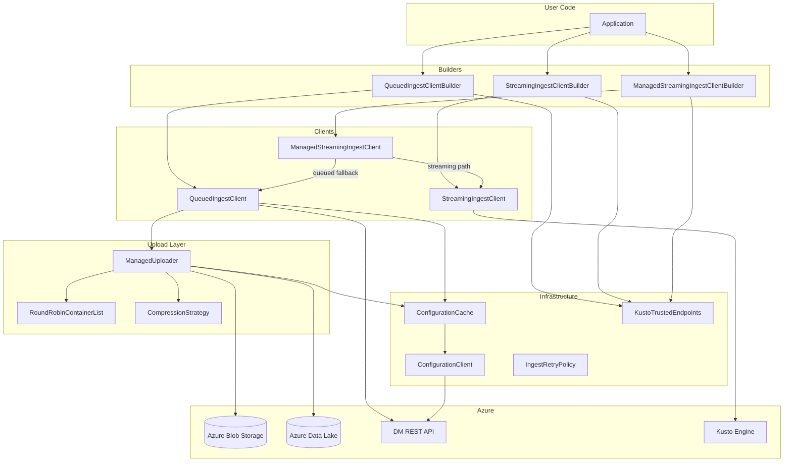

---

## 3. Package Breakdown

### 3.1 `client/` — Ingestion Clients

The central contract is `IngestClient`. Three implementations provide queued, streaming, and hybrid ingestion.

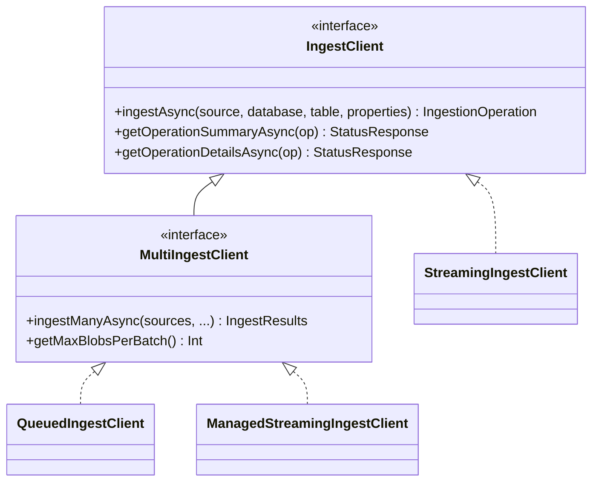

| File | Role | Key Methods |
|------|------|-------------|
| `IngestClient.kt` | Core interface. Defines `ingestAsync`, status-query APIs, and Java-friendly `CompletableFuture` wrappers. `MultiIngestClient` extends it with batch support. | `ingestAsync`, `getOperationSummaryAsync`, `getOperationDetailsAsync`, `ingestManyAsync` |
| `StreamingIngestClient.kt` | Posts data directly to the Kusto engine endpoint. Handles file/stream/blob sources, enforces the ~4 MB streaming size limit, and parses OneAPI-style error responses. | `ingestAsyncInternal` — routes by source type. `submitStreamingIngestion` — sends the HTTP request. `handleIngestResponse` — maps HTTP status codes to exceptions. `getMaxStreamingIngestSize` — returns the engine size cap. |
| `QueuedIngestClient.kt` | Uploads data to Azure Storage via `IUploader`, then submits an ingest request to the DM REST API. Supports multi-blob batches and operation-status polling. | `ingestAsyncInternal` — orchestrates upload + queue POST. `ingestAsyncSingleInternal` — uploads a single local source. `getIngestionDetails` / `pollUntilCompletion` — track operation status. |
| `ManagedStreamingIngestClient.kt` | Hybrid client. Tries streaming first; falls back to queued on failure or when data exceeds the streaming threshold. Uses `ManagedStreamingPolicy` for fallback decisions. | `ingestAsync` — routes by source type. `shouldUseQueuedIngestBySize` / `shouldUseQueuedIngestByPolicy` — pre-flight checks. `invokeStreamingIngestionAsync` — retries streaming, falls back on persistent errors. `decideOnException` — classifies errors for the policy. |
| `IngestionOperation.kt` | Lightweight tracking token containing `operationId`, `database`, `table`, and `ingestKind` (STREAMING or QUEUED). Returned by `ingestAsync` and passed to status APIs. | — (data class) |

---

### 3.2 `client/policy/` — Managed Streaming Decisions

Controls when `ManagedStreamingIngestClient` should skip streaming and go directly to queued ingestion.

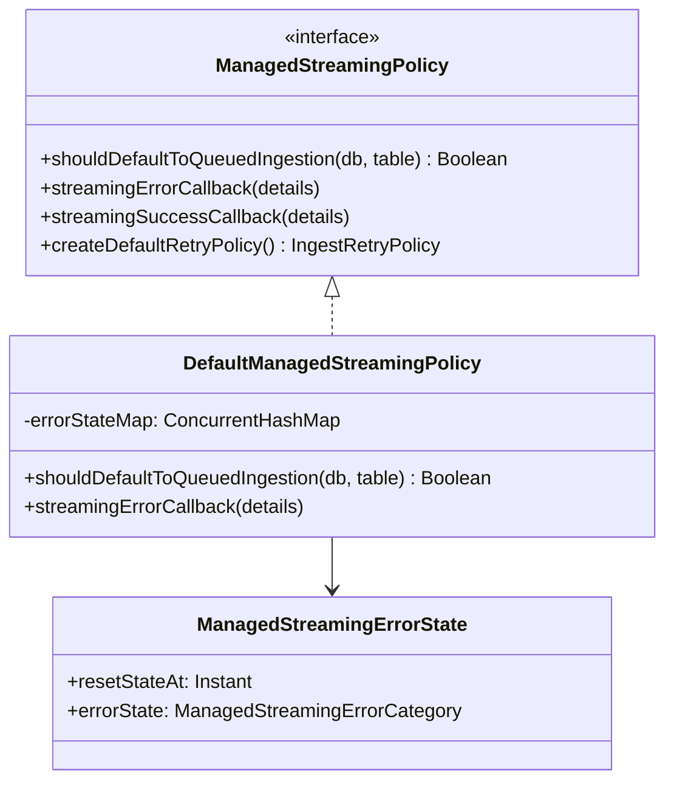

| File | Role | Key Methods |
|------|------|-------------|
| `ManagedStreamingPolicy.kt` | Interface + supporting models. Defines `ManagedStreamingErrorCategory` (STREAMING_OFF, TABLE_CONFIG, THROTTLED, UNKNOWN) and callback detail classes. | `shouldDefaultToQueuedIngestion`, `streamingErrorCallback`, `streamingSuccessCallback`, `createDefaultRetryPolicy` |
| `DefaultManagedStreamingPolicy.kt` | Default implementation. Maintains a per-table error-state map. On streaming failure, sets a "queued fallback window" (duration varies by error category). After the window expires, streaming is retried. | `shouldDefaultToQueuedIngestion` — checks if a table is in a fallback window. `streamingErrorCallback` — records error + window duration. `createDefaultRetryPolicy` — jittered backoff. |
| `ManagedStreamingErrorState.kt` | Simple state holder: `resetStateAt` (when to retry streaming) and `errorState` (which error caused the fallback). | — (data class) |

---

### 3.3 `builders/` — Client Construction

Fluent builder pattern. All three concrete builders inherit from `BaseIngestClientBuilder`.

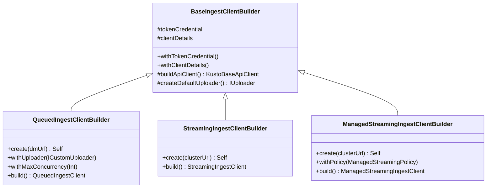

| File | Role | Key Methods |
|------|------|-------------|
| `BaseIngestClientBuilder.kt` | Shared builder foundation. Handles auth (`TokenCredential`), trusted-endpoint validation, Fabric Private Link setup, client-details tracing, and default uploader creation. | `withTokenCredential`, `withClientDetails`, `buildApiClient`, `createDefaultUploader` |
| `QueuedIngestClientBuilder.kt` | Builds `QueuedIngestClient`. Accepts a DM URL, optional custom uploader, max concurrency, max data size, and configuration overrides. | `create(dmUrl)`, `withUploader`, `withMaxConcurrency`, `withMaxDataSize`, `build` |
| `StreamingIngestClientBuilder.kt` | Builds `StreamingIngestClient`. Minimal — only needs a cluster URL and auth. | `create(clusterUrl)`, `build` |
| `ManagedStreamingIngestClientBuilder.kt` | Builds the hybrid `ManagedStreamingIngestClient`. Internally constructs both a queued and streaming client, a shared config cache, and an optional custom `ManagedStreamingPolicy`. | `create(clusterUrl)`, `withPolicy`, `build` |

---

### 3.4 `uploader/` — Blob Upload Engine

Responsible for uploading local data to Azure Blob Storage or Data Lake before queued ingestion.

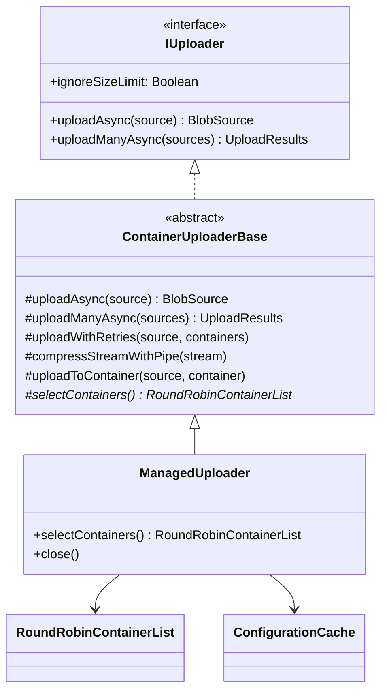

| File | Role | Key Methods |
|------|------|-------------|
| `IUploader.kt` | Upload contract. Kotlin suspend + Java `CompletableFuture` wrappers. Also defines `ICustomUploader` bridge. | `uploadAsync`, `uploadManyAsync` |
| `ICustomUploader.kt` | Java-first custom uploader interface. `CustomUploaderHelper.asUploader` adapts it to `IUploader`. | `uploadAsync(LocalSource)`, `uploadManyAsync(List<LocalSource>)` |
| `ContainerUploaderBase.kt` | Core upload engine (~780 lines). Validates sources, optionally compresses streams (piped gzip), retries with container cycling, and uploads via Blob or Data Lake API. | `uploadAsync` — validate → compress → retry-upload. `compressStreamWithPipe` — async piped GZIP. `uploadWithRetries` — retry loop with round-robin container selection. `uploadManyAsync` — concurrent batch upload with semaphore. `uploadToContainer` / `uploadUsingBlobApi` / `uploadUsingDataLakeApi` — actual Azure SDK calls. |
| `ManagedUploader.kt` | Concrete uploader. Chooses containers (blob vs. lake) from cached service configuration. | `selectContainers` — picks container list based on `UploadMethod` and config. |
| `ManagedUploaderBuilder.kt` | Fluent builder for `ManagedUploader`. | `withMaxConcurrency`, `withMaxDataSize`, `withConfigurationCache`, `withUploadMethod`, `build` |
| `RoundRobinContainerList.kt` | Thread-safe wrapper around a list of containers with a shared atomic counter for round-robin selection. Ensures load distribution across uploaders. | `getNextStartIndex`, `toList` |
| `ExtendedContainerInfo.kt` | Pairs container metadata (`ContainerInfo`) with an `UploadMethod` (STORAGE or LAKE). | — (data class) |
| `UploadMethod.kt` | Enum: `DEFAULT`, `STORAGE`, `LAKE`. Determines whether to use Blob or Data Lake API. | — |
| `models/UploadResult.kt` | Per-source upload outcome. `Success` contains the resulting `BlobSource`; `Failure` contains the error. `UploadResults` wraps a batch. | — (sealed class) |
| `models/UploadErrorCode.kt` | Canonical error codes for upload failures (validation, size limit, container, network, auth, unknown). | — |

---

### 3.5 `uploader/compression/` — Compression Strategies

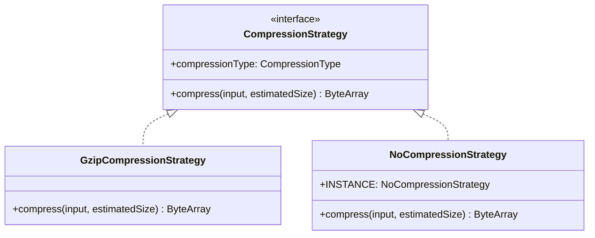

| File | Role |
|------|------|
| `CompressionStrategy.kt` | Interface. `compress(input, estimatedSize)` returns compressed bytes; `compressionType` reports the type. |
| `GzipCompressionStrategy.kt` | In-memory GZIP compressor. Runs on `Dispatchers.IO`, logs compression ratio and time, wraps errors in `CompressionException`. |
| `NoCompressionStrategy.kt` | Pass-through. Returns input unchanged. Singleton `INSTANCE`. Used when data is already compressed or compression is disabled. |
| `CompressionException.kt` | Runtime exception for compression failures. |

---

### 3.6 `source/` — Ingestion Data Sources

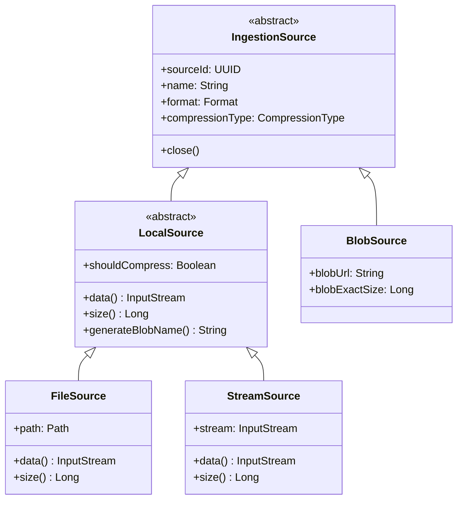

| File | Role | Key Methods |
|------|------|-------------|
| `IngestionSource.kt` | Abstract base. Holds `sourceId`, `name`, `format`, `compressionType`. | `initName`, `close` |
| `LocalSource.kt` | Base for locally readable sources. Determines whether compression is needed (skips binary formats like Parquet/Avro). | `data`, `size`, `shouldCompress`, `generateBlobName` |
| `FileSource.kt` | File-backed source. Opens/caches the file stream; detects compression from file extension. | `data` — opens file, maps IO errors to `InvalidUploadStreamException`. `size` — uses `Files.size`. `detectCompressionFromPath`. |
| `StreamSource.kt` | InputStream-backed source. Wraps an existing stream for direct ingestion. | `data`, `size` (uses `available()`) |
| `BlobSource.kt` | Represents an already-uploaded blob. Returned by the uploader after a successful upload. Strips SAS tokens in trace output. | `size`, `getPathForTracing` |
| `CompressionType.kt` | Enum: `GZIP`, `ZIP`, `NONE`. Used for file naming and compression decisions. | `toString` — returns suffix (`gz`, `zip`, or empty) |
| `FormatUtil.kt` | Utility to check if a format is binary (Avro, Parquet, ORC). Binary formats skip compression. | `isBinaryFormat(format)` |

---

### 3.7 `common/` — Shared Infrastructure

#### Configuration & Caching

| File | Role | Key Methods |
|------|------|-------------|
| `ConfigurationCache.kt` | Interface + default impl. `DefaultConfigurationCache` fetches config from DM via `ConfigurationClient`, caches it, and exposes shared round-robin container lists. Supports custom providers and S2S token providers for Fabric Private Link. | `getConfigurationAsync`, `getContainers`, `refresh` |
| `ConfigurationClient.kt` | HTTP client that calls the DM `/v1/rest/ingestion/configuration` endpoint. Extends `KustoBaseApiClient`. | `getConfigurationDetails` — fetches config, throws `IngestException` on failure. |

#### Retry

| File | Role | Key Methods |
|------|------|-------------|
| `IngestRetryPolicy.kt` | Retry policy primitives. `moveNext()` returns a `RetryDecision`. Implementations: `NoRetryPolicy`, `SimpleRetryPolicy` (fixed delay), `CustomRetryPolicy` (custom delays). | `moveNext`, `reset` |
| `RetryPolicyExtensions.kt` | Extension function `runWithRetry()` on `IngestRetryPolicy`. Handles the retry loop, delay, cancellation, and hooks (`onRetry`, `onError`, `shouldRetry`). | `runWithRetry` |

#### Models

| File | Role |
|------|------|
| `models/IngestRequestPropertiesBuilder.kt` | Builder for `IngestRequestProperties`. Combines tags, validates mapping, auto-sets format. |
| `models/IngestRequestPropertiesExtensions.kt` | Extension helpers to extract/rewrite tags on `IngestRequestProperties`. |
| `models/ClientDetails.kt` | Tracing metadata: app name, user, version, SDK info. Sent as HTTP headers. |
| `models/StreamingIngestionErrorResponse.kt` | Serializable model for streaming ingestion error payloads from the engine. |
| `models/S2SToken.kt` | S2S auth token model with `toHeaderValue()` and `bearer()` factory. |
| `models/ExtendedResponseTypes.kt` | `IngestKind` enum (STREAMING/QUEUED) and `ExtendedIngestResponse`. |

#### Mapping

| File | Role |
|------|------|
| `models/mapping/IngestionMapping.kt` | Mapping by reference name or inline column mappings. `serializeColumnMappingsToJson()` emits JSON. |
| `models/mapping/ColumnMapping.kt` | Column-mapping model with validation per format (CSV, JSON, Avro). |
| `models/mapping/MappingConstants.kt` | String keys for column-mapping property maps (`Path`, `Transform`, `Ordinal`, etc.). |
| `models/mapping/TransformationMethod.kt` | Enum of mapping transformations (`SourceLocation`, `SourceLineNumber`, etc.). |

#### Utils

| File | Role |
|------|------|
| `utils/IngestionUtils.kt` | Estimates row-store inflation/size factors based on format and compression. |
| `utils/IngestionResultUtils.kt` | Helpers for `BlobStatus` lists: detect failures, completion, filter succeeded/failed. |
| `utils/PathUtils.kt` | Filename/path helpers: sanitize source IDs, create upload file names, extract basenames. |

#### Exceptions

| File | Role |
|------|------|
| `common/exceptions/IngestException.kt` | Full exception hierarchy: `IngestException` base → request/service/client exceptions → size-limit/mapping/upload exceptions. Central error base used across all layers. |

#### Other

| File | Role |
|------|------|
| `BatchOperationResult.kt` | Generic interface for batch outcomes: `successes`, `failures`, `hasFailures`, `allSucceeded`. |
| `serialization/OffsetDateTimeSerializer.kt` | kotlinx.serialization serializer for `OffsetDateTime` using ISO-8601 strings. |

#### Base / Entry Point

| File | Role | Key Methods |
|------|------|-------------|
| `IngestV2.kt` | Module-wide constants: upload sizes, timeouts, API version, config-cache defaults, streaming thresholds, HTTP header names. | — (constants object) |
| `IngestClientBase.kt` | URL utility object. Converts cluster URLs to ingest/query endpoints and detects reserved hostnames. | `getIngestionEndpoint`, `getQueryEndpoint`, `isReservedHostname` |
| `KustoBaseApiClient.kt` | Shared HTTP client foundation. Configures Ktor auth (bearer token from `TokenCredential`), tracing headers, content negotiation, timeouts, and optional S2S/Fabric Private Link headers. | `api` (lazy HTTP client), `getBearerToken` |

#### Auth & Endpoint Security

| File | Role |
|------|------|
| `auth/endpoints/KustoTrustedEndpoints.kt` | Central trusted-endpoint validator. Loads well-known rules, supports overrides, treats loopback as trusted. Throws `KustoClientInvalidConnectionStringException` on untrusted hosts. |
| `auth/endpoints/WellKnownKustoEndpointsData.kt` | Lazy loader for `WellKnownKustoEndpoints.json`. Caches parsed endpoint data. |
| `auth/endpoints/FastSuffixMatcher.kt` | Fast hostname/suffix matcher. Supports exact and suffix matches plus matcher merging. |
| `exceptions/KustoClientInvalidConnectionStringException.kt` | Runtime exception for invalid/untrusted connection strings. |

---

## 4. Program Flow — Queued Ingestion

The most common path. Data is uploaded to Azure Storage, then a request is posted to the DM REST API to queue ingestion.

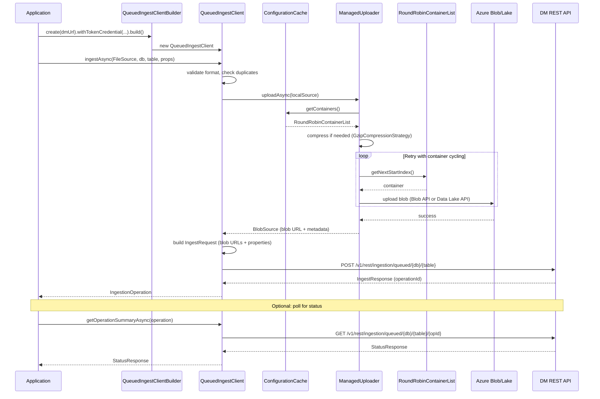

### Key Decision Points in Queued Ingestion

1. **Compression**: `LocalSource.shouldCompress` checks if the format is binary (Parquet, Avro, ORC). Binary formats skip compression.
2. **Container Selection**: `ManagedUploader.selectContainers()` prefers Data Lake or Blob Storage based on the `preferredUploadMethod` from the DM configuration.
3. **Retry**: `uploadWithRetries` uses `IngestRetryPolicy` and cycles through containers on transient failures.
4. **Batch Upload**: `uploadManyAsync` runs concurrent uploads controlled by a semaphore (`maxConcurrency`).

---

## 5. Program Flow — Streaming Ingestion

Low-latency path. Data is sent directly to the Kusto engine. Limited to ~4 MB.

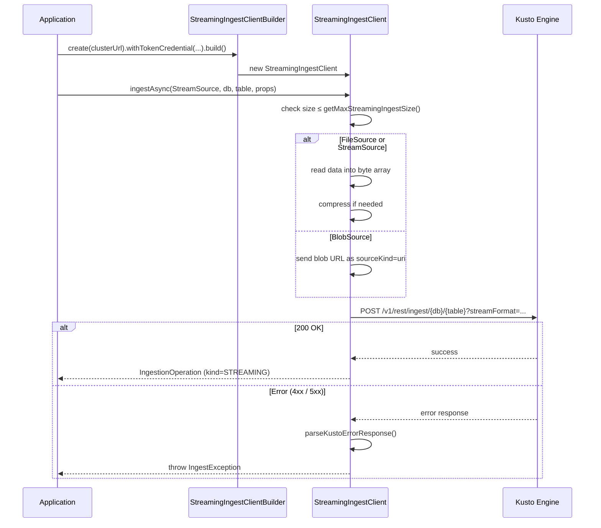

### Key Decision Points in Streaming Ingestion

1. **Size Gate**: `getMaxStreamingIngestSize()` returns the engine's maximum (~4 MB). Exceeding it throws `IngestSizeLimitException`.
2. **Source Handling**: `FileSource` and `StreamSource` are read into memory and optionally compressed. `BlobSource` sends only the URL with `sourceKind=uri`.
3. **Error Parsing**: `parseKustoErrorResponse()` extracts OneAPI-style error payloads to produce actionable exception messages.

---

## 6. Program Flow — Managed Streaming

The recommended mode. Tries streaming for speed; falls back to queued for reliability.

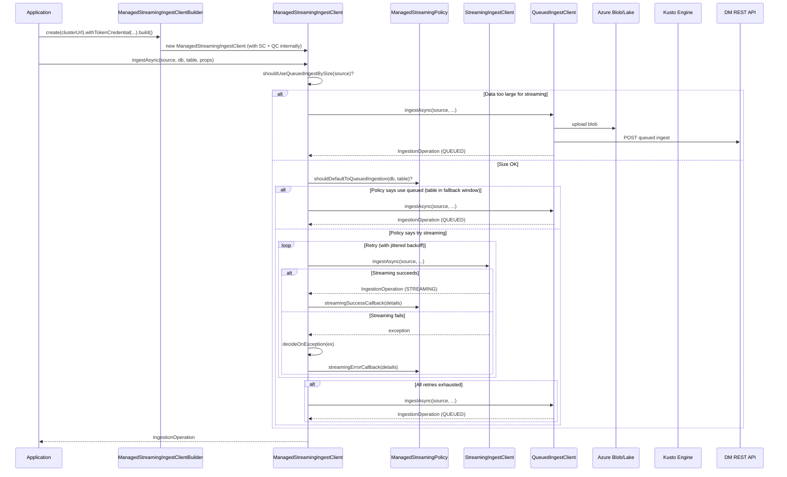

### Key Decision Points in Managed Streaming

1. **Size Check** (`shouldUseQueuedIngestBySize`): If the source data exceeds the streaming threshold, bypass streaming entirely.
2. **Policy Check** (`shouldDefaultToQueuedIngestion`): The `DefaultManagedStreamingPolicy` maintains per-table error state. If a table recently had streaming failures (STREAMING_OFF, TABLE_CONFIG, THROTTLED), it enters a "queued fallback window" and skips streaming until the window expires.
3. **Error Classification** (`decideOnException`): Maps exceptions to `ManagedStreamingErrorCategory`:
   - `STREAMING_OFF` → streaming not enabled on cluster
   - `TABLE_CONFIG` → table-level config issue
   - `THROTTLED` → rate limited
   - `UNKNOWN` → transient/unexpected errors
4. **Fallback**: After all streaming retries are exhausted, the data is ingested via the queued path automatically.

---

## 7. Configuration & Caching

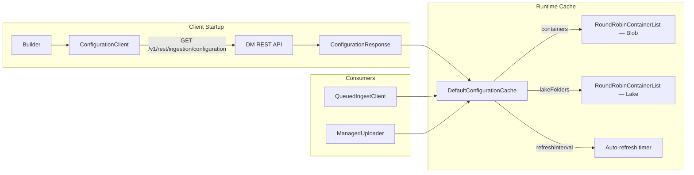

**How it works:**

- `ConfigurationClient` extends `KustoBaseApiClient` and calls `GET /v1/rest/ingestion/configuration` on the DM endpoint.
- `DefaultConfigurationCache` wraps the response in `CachedConfigurationData`, which pre-builds shared `RoundRobinContainerList` instances for blob containers and lake folders.
- The cache refreshes on a timer based on `refreshInterval` from the server response.
- The round-robin lists use an `AtomicInteger` counter shared across all uploaders, ensuring even distribution of uploads across containers.
- For Fabric Private Link scenarios, the cache supports an S2S token provider that injects `S2SToken` headers into configuration requests.

---

## 8. Auth & Security

### Trusted Endpoint Validation

Before any client is built, the builder validates the target URL against `KustoTrustedEndpoints`:

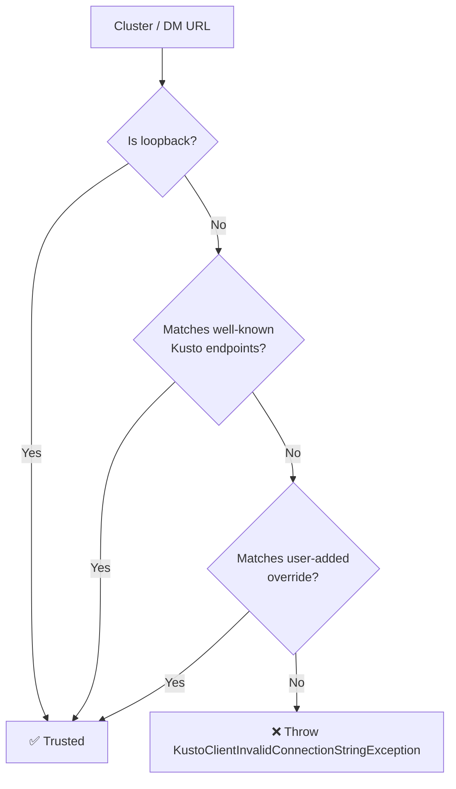

- `WellKnownKustoEndpointsData` lazily loads trusted endpoint rules from a bundled JSON resource.
- `FastSuffixMatcher` provides efficient hostname/suffix matching, supporting both exact and wildcard suffix rules, plus matcher merging.
- Loopback addresses (`localhost`, `127.x.x.x`, `::1`) are always trusted.
- Additional trusted hosts can be registered at runtime via `KustoTrustedEndpoints.addTrustedHost(...)`.

### Authentication Flow

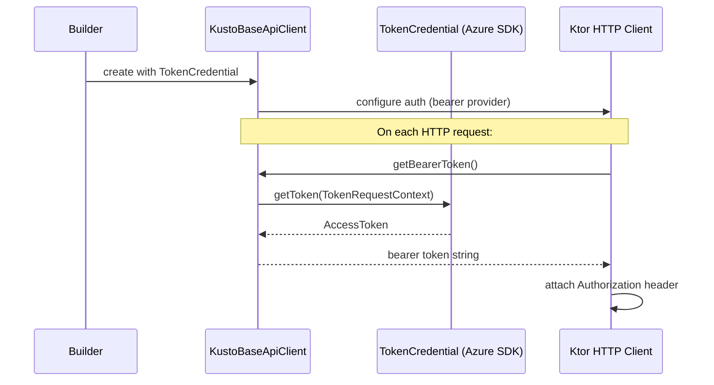

- `KustoBaseApiClient` bridges the Azure SDK's `TokenCredential` to Ktor's bearer auth plugin.
- `getBearerToken()` requests a token scoped to the Kusto resource.
- For Fabric Private Link, an additional `S2SToken` header is injected alongside the bearer token.
- `ClientDetails` appends tracing headers (app name, user, SDK version) to every request.
